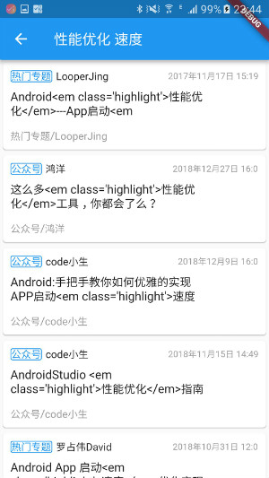
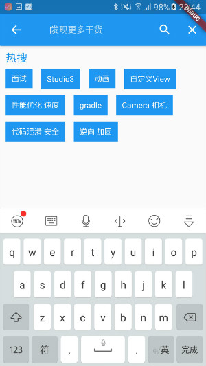
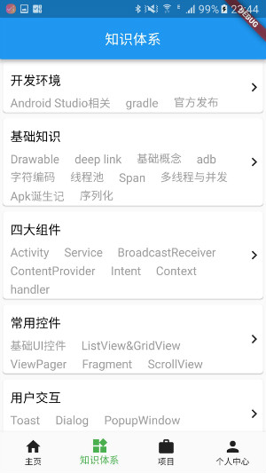
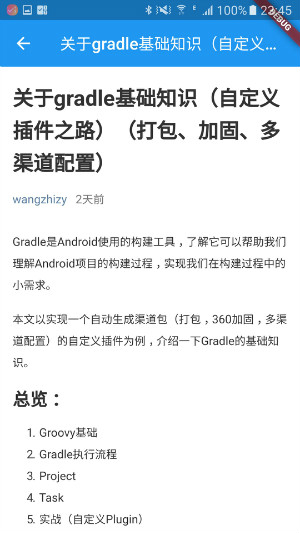

#### 引言
学习了两周的Flutter，准备写个小项目练练手，正好洪洋的玩Android有免费的Api可以用，就写个简易版的玩Android吧。

#### 项目截图







#### 主要技术点
* 常用widget的使用
* 下拉刷新和上拉加载更多的使用
* 列表状态判断，数据为空，loading界面
* dio网络库的使用
* webview使用
 #### 第三库
*  网络库
```
  dio: ^1.0.12  #网络框架
```
*  Loading控件

```
  flutter_spinkit: ^3.0.0 #进度条
```
*  轮播图

```
banner_view: "^1.1.2" #轮播图
```
*  webview

```
  flutter_webview_plugin: ^0.2.1+2
```
 #### 总结
Flutter是一个很好的多平台开发解决方案框架。Flutter更类似于前端开发，布局方式也和前端更接近，对于前端开发者来说可能更友好一些，写惯了Android开发的xml布局，可能对这种代码里面写布局的方式有点不习惯，并且这种资源文件需要每个都配置有点恶心，而且错误提示也不是很友好。
 
  总的来说，不过Flutter的everything is widget 的思想还是很好的，但是呢还是有很多坑，而且也有很多对开发者不是很友好的地方，希望慢慢更新的过程中越来越完美吧。
  #### 项目地址
  [https://github.com/mouxuefei/F-WanAndroid](https://github.com/mouxuefei/F-WanAndroid)
